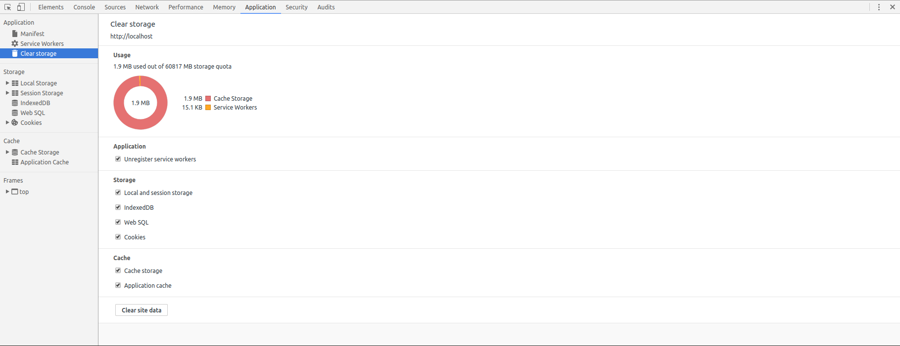

# Usage

## 開発するには

### 1. フロントエンドを一度ビルドする

```bash
$ cd frontend/
$ npm run build
# フロントエンドの開発をしているときは npm run watchすると継続的にビルドする
```

### 2. DBとサーバーの両方を立ち上げる

```bash
$ docker-compose up
```

ブラウザでlocalhost開けば多分動いてるはず。

### 3. フロントエンド変えたらブラウザキャッシュを消す

PWAなのでService Workerとかが登録されてフロントエンドのファイルが変わっていてもフロントエンドが更新されなかったりするので更新してあげましょう。



### [Extra] Dockerfileに変更を加えてイメージをビルドし直す

おそらく必要な場面はないはず。

```bash
$ docker-compose build
```
